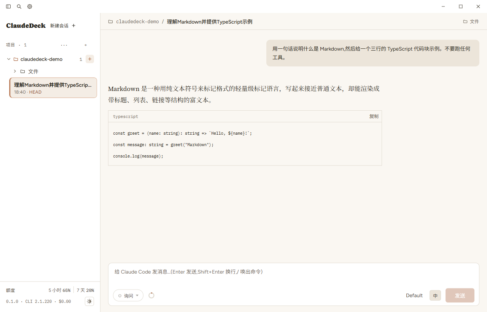
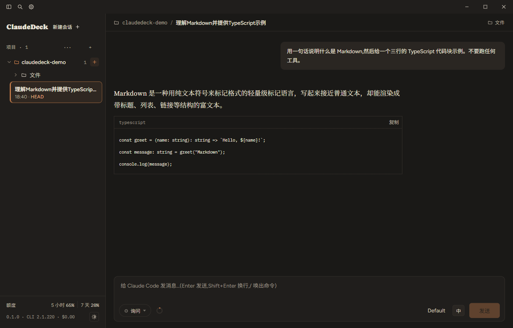
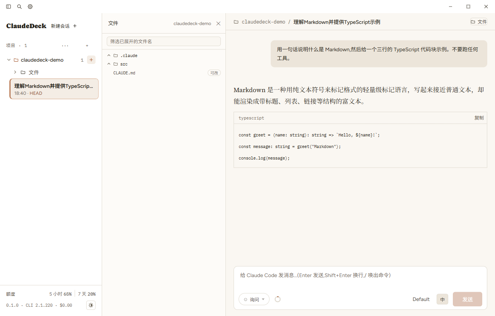
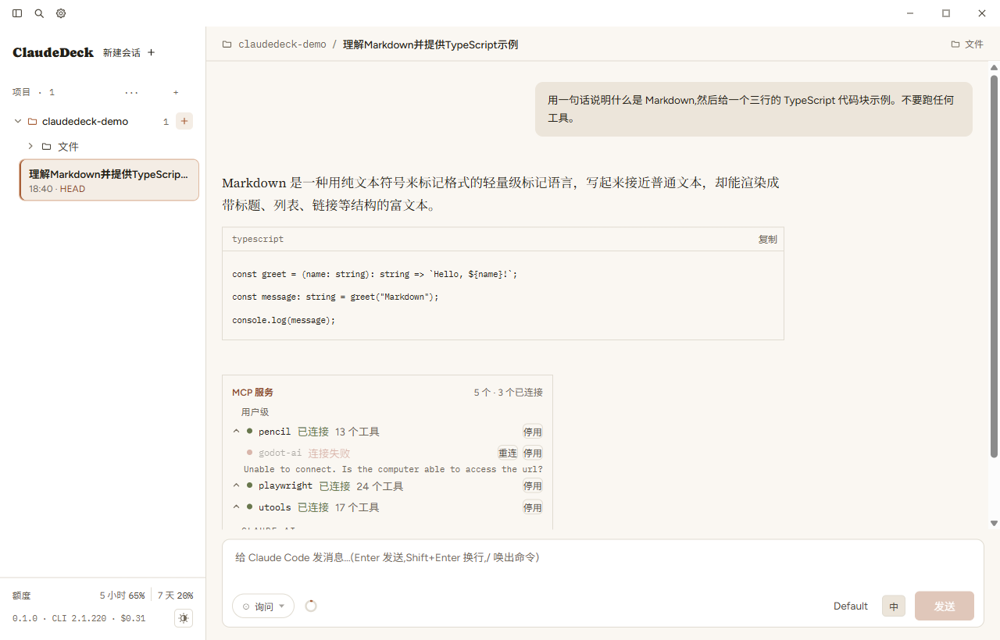
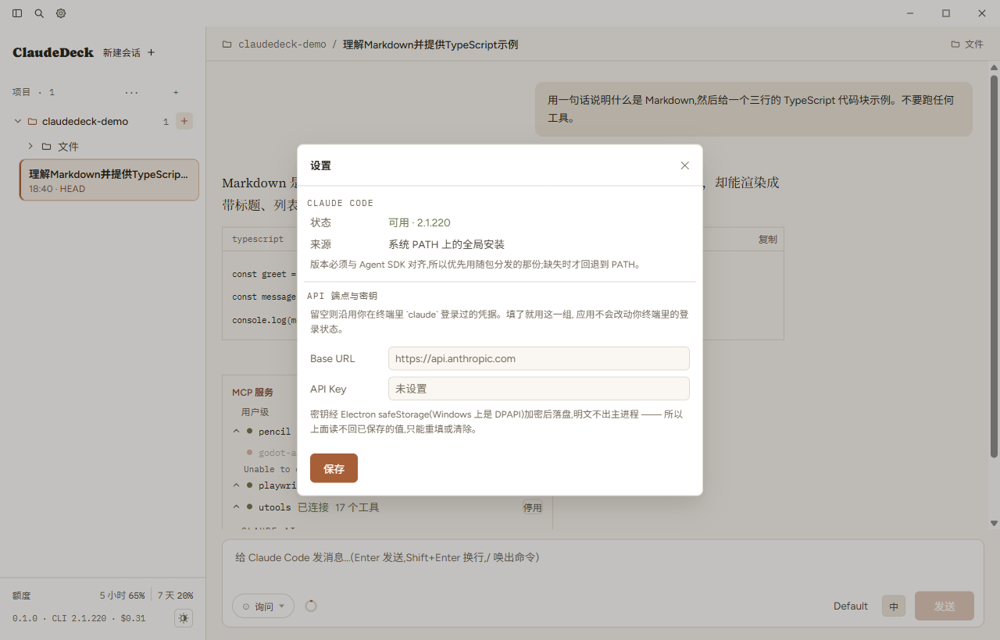
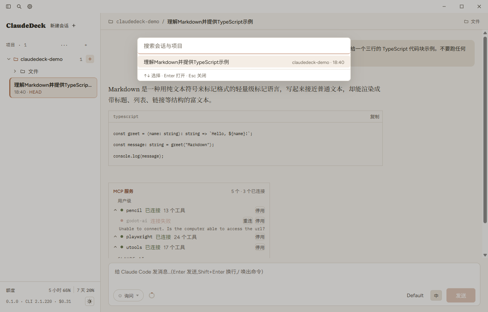

<div align="center">


# ClaudeDeck

**把 Claude Code 装进窗口的桌面客户端。**

Claude Desktop 能聊天、能接 MCP,但它不会动你的代码。
终端里的 Claude Code 什么都能干,可界面就是一块黑屏 ——
没有会话列表,没有可点的权限卡,看不见上下文被谁占满了。
ClaudeDeck 补的是这中间那块空缺。

[](https://github.com/Tenkkk/ClaudeDeck/actions/workflows/ci.yml)
[](https://github.com/Tenkkk/ClaudeDeck/releases/latest)
[](LICENSE)

</div>

> **非官方项目。** ClaudeDeck 由个人开发,与 Anthropic 无隶属、赞助或背书关系。
> Claude 与 Claude Code 是 Anthropic 的商标,此处仅作描述性使用。



---

## 它和 Claude Desktop 的差别

两者不是同一类东西。Claude Desktop 是**聊天**客户端;ClaudeDeck 是把
**Claude Code 这个会读写文件、会跑命令的 Agent** 搬进图形界面。

| | Claude Desktop | 终端里的 Claude Code | ClaudeDeck |
|---|---|---|---|
| 直接改你项目里的文件 | ✗ | ✓ | ✓ |
| 会话列表、点回任意一次对话 | ✓ | 只能 `--resume` 猜 | ✓ 按项目分组 |
| 工具调用可视 | — | 纯文本刷屏 | ✓ 分类工具行、diff 带颜色 |
| 权限逐次批准 | — | 键盘选 | ✓ 行内卡片,可记住 |
| 上下文被谁占满了 | ✗ | `/context` 一次性 | ✓ 常驻环形入口 + 分类明细 |
| MCP 服务状态与启停 | ✓ | `/mcp` | ✓ 面板,可展开工具清单 |
| 多个项目并列 | — | 一个终端一个目录 | ✓ 侧栏两层 |
| 深色主题 | ✓ | 跟终端 | ✓ |

如果你已经在用终端里的 Claude Code,ClaudeDeck 不改变它的行为 ——
它用的就是同一个 Claude Code、同一份 `~/.claude` 会话记录。
换个界面而已,随时可以切回终端。

---

## 主要能力

### 对话与工具调用一目了然

正文按 Markdown 渲染,代码块单独成块、带语言标签和复制。
Claude 的思考过程默认折叠,想看再展开。
等待时给出已用时长与本轮输出的 token 数,不会只剩一屏空白。



### 项目文件就在手边

每个项目下都有「文件」入口,中栏展开整个项目树。
`.claude/` 只是树里的一个普通文件夹 —— 配置随手就能改,
JSON 写坏了在**保存前**就被拦住并指出行号。

> 浏览是整个项目,**可写的只有 `.claude/` 和项目根的 `CLAUDE.md`**。
> 一个聊天客户端不该顺带成为可修改任意源码的编辑器。



### MCP 服务看得见、点得动

`/mcp` 不是一段文字回执,是一块面板:按来源分组,标出连接状态与工具数,
展开能看每个工具(带只读 / 破坏性标注),连不上的可以直接重连或停用。



### 接管情况写在明处

设置里直接告诉你:这个应用在用**哪一份** Claude Code、版本多少、
可执行文件在哪。版本对不上时,排查从这里开始。

API 端点与密钥也在这里填。密钥经 Electron `safeStorage`
(Windows 上是 DPAPI)加密后落盘,明文不出主进程 ——
所以界面读不回已保存的值,只能重填或清除。



### 跨项目搜索会话



### 还有

- **切换模型**:列表在运行时向 SDK 查询,带上官方的说明文字;会话进行中可随时切换,历史不中断
- **Effort 五档**:可拖的停靠滑块;模型不支持努力程度时(如 Haiku)直接禁用
- **四档权限**:询问 / 接受编辑 / 计划 / 完全放行,行内卡片批准,可「本次会话内不再问」
- **分支与文件回退**:从任意一条消息重答会新建分支,可同时把文件回退到那一刻
- **子进程面板**:后台任务可展开、单独停止,也能把当前任务转入后台
- **斜杠命令面板**:命令由 SDK 运行时提供,按「内置 / 项目命令 / Skill」分组,按相关度排序
- **会话管理**:重命名、打标签、分支、在资源管理器中打开、删除

---

## 安装

到 [Releases](https://github.com/Tenkkk/ClaudeDeck/releases/latest) 下载
`ClaudeDeck-<版本>-win-x64.exe`,双击安装。目前只支持 Windows 10 / 11。

**不用单独装 Claude Code。** Agent SDK 把版本配套的 `claude` 可执行文件作为
可选依赖一起装了,安装包也把它一并带上(这也是安装包 150 MB 出头的原因)。
版本必须与 SDK 对齐,所以宁可随包分发,也不去赌本机全局装的是哪个版本。
只有在这份配套文件缺失时,才回退去找 PATH 上的 `claude`。

登录方式二选一:

1. **已在终端里 `claude` 登录过** —— 直接沿用,无需配置
2. **API Key / 中转端点** —— 在首次配置页或设置里填 `ANTHROPIC_BASE_URL` 和 API Key

---

## 从源码运行

```bash
npm install
npm run dev
```

> **国内网络补充。** `npm install` 只装 Electron 的壳包,真正的二进制由
> postinstall 从 GitHub 下载,在国内常常静默失败,表现为启动时报
> `Error: Electron uninstall`。补下载:
>
> ```bash
> ELECTRON_MIRROR="https://npmmirror.com/mirrors/electron/" node node_modules/electron/install.js
> ```
>
> 镜像**没有**写进仓库的 `.npmrc`:CI 构建的是用户会下载安装的产物,
> 那条链路应当只从官方源取二进制。

### 打包与发布

```bash
npm run icon    # 由 build/icon.svg 生成图标(改了图标才需要)
npm run dist    # 产物在 release/,NSIS 安装包
```

推一个 `v*` 标签即触发 CI 构建并创建 GitHub Release。

---

## 测试

五层。前两层不产生 API 调用,后三层会。

| 命令 | 验什么 | API |
|---|---|---|
| `npm run unit` | 纯函数:路径截断、工具行归一化、Markdown 解析、命令排序、路径收敛 | 否 |
| `npm run contrast` | 两套主题的对比度下限 | 否 |
| `npm run measure` | 按设计终稿逐条量尺寸、三档宽度、配色规则 | 否 |
| `npm run smoke` | SDK 那一层:流式聊天、`setModel`、会话读写 | 是 |
| `npm run e2e` | Playwright 驱动真实窗口,验「点了按钮之后事情有没有真的发生」 | 是 |
| `npm run packaged` | 打包产物本身能不能起、能不能收到回复 | 是 |

`e2e` 跑一次全量十几分钟。只改了一节的话不必从头跑:

```bash
node scripts/e2e.mjs --only 10,11
```

第 0 节(引导与桥接)永远跑。各节变量互不引用,但**状态是累积的** ——
单跑靠后的节可能因为前置状态不在而失败,那是预期内的。

**为什么单独有 `packaged` 这一层:** 前几层跑的都是开发构建,`node_modules`
摊在磁盘上。打包后它被压进 `app.asar`,而 asar 里的可执行文件是 spawn 不起来的 ——
「开发正常、安装后打不开」这一整类问题,前几层一条都照不到。

---

## 架构

```
┌─────────────────────────────────────────────────┐
│ Renderer (React)   contextIsolation: true       │
│   界面 / 状态 / 流式渲染                          │
└──────────────────┬──────────────────────────────┘
                   │ contextBridge 暴露的白名单 API
┌──────────────────┴──────────────────────────────┐
│ Preload                                         │
└──────────────────┬──────────────────────────────┘
                   │ IPC
┌──────────────────┴──────────────────────────────┐
│ Main (Node)                                     │
│   @anthropic-ai/claude-agent-sdk                │
│   凭据(safeStorage) / 环境检测 / 会话管理        │
└──────────────────┬──────────────────────────────┘
                   │ SDK 拉起
┌──────────────────┴──────────────────────────────┐
│ Claude Code                                     │
└─────────────────────────────────────────────────┘
```

几条贯穿全局的取舍:

- **会话不做本地副本。** SDK 自带 `listSessions` / `getSessionMessages` /
  `renameSession` / `deleteSession`,其 session store 即单一事实来源。
  应用只保存自己的偏好:项目清单、模型、Effort、权限档、凭据。
  所以你在终端里开的会话,这里看得到;这里开的,终端也认。
- **始终使用流式输入模式。** `setModel` / `setPermissionMode` / `interrupt` /
  `canUseTool` 这些控制方法只在流式模式下受支持。
- **渲染层的输入一律不可信。** 文件路径在主进程里做硬性收敛,越界直接拒绝。
- **拿不到的数据就不画。** 额度接口在 API Key / Bedrock / Vertex 会话下会
  报 `available: false`,那一整块就消失 —— 不留空槽、不写「未知」、
  不画一个可能不准的百分比。

### 文件结构

```
src/
  main/                 主进程:窗口、IPC、SDK 会话、凭据、环境检测
    index.ts              入口与全部 IPC 处理
    chat.ts               ChatSession —— 流式输入模式下的一次对话
    config.ts             偏好与 safeStorage 凭据(含旧结构迁移)
    doctor.ts             Claude Code 检测与安装
    binary.ts             定位随包分发的可执行文件(打包后不能走 asar)
    claudedir.ts          文件树与 .claude 读写,路径收敛在这里
    tools.ts              把 SDK 的工具调用归一化成界面能画的行
    dialogs.ts            AskUserQuestion / ExitPlanMode 的入参归一化
    history.ts            重建历史时还原被展开的斜杠命令
  preload/              contextBridge 白名单 API
  renderer/src/
    App.tsx               四屏路由与主界面
    screens/              加载 / 首次配置 / 选择项目
    components/           标题栏、侧栏、消息、工具行、各类面板
    lib/                  Markdown 解析、命令排序、列宽夹逼等纯函数
    styles.css            设计 token
    layout.css            骨架样式,只引用 token
  shared/               主进程与渲染层共用的类型
scripts/                unit / contrast / measure / smoke / e2e / packaged / icon
build/                  图标源与生成物
docs/
  DESIGN-SPEC.md          界面规格
  IMPLEMENTATION-BRIEF.md 实施说明
```

---

## 路线图

当前可用的能力见 [CHANGELOG](CHANGELOG.md)。接下来打算做的:

- 会话正文的全文搜索(目前只搜标题与首句)
- 文件树里的编辑范围可配置
- macOS 支持

**已知边界:** 额度接口是实验性的,API Key / Bedrock / Vertex 会话拿不到;
`/help` 这类命令在 SDK 环境下由 Claude Code 自己回「不可用」。

---

## 文档

- [界面规格](docs/DESIGN-SPEC.md) —— 界面的结构、状态与文案
- [实施说明](docs/IMPLEMENTATION-BRIEF.md) —— 设计与工程的对照、接口清单与五个坑
- [CLAUDE.md](CLAUDE.md) —— 给 AI 协作者的约束、SDK 能力清单与踩过的坑
- [更新日志](CHANGELOG.md)

## 参与

欢迎提 issue 反馈问题。提 PR 前请确保:

```bash
npm run typecheck && npm run unit && npm run build
```

`smoke` / `e2e` / `packaged` 会产生真实 API 调用,不进 CI,按需本地跑。

## License

本项目以 [MIT](LICENSE) 发布。随包分发的第三方内容(字体等)见 [NOTICE](NOTICE.md)。
